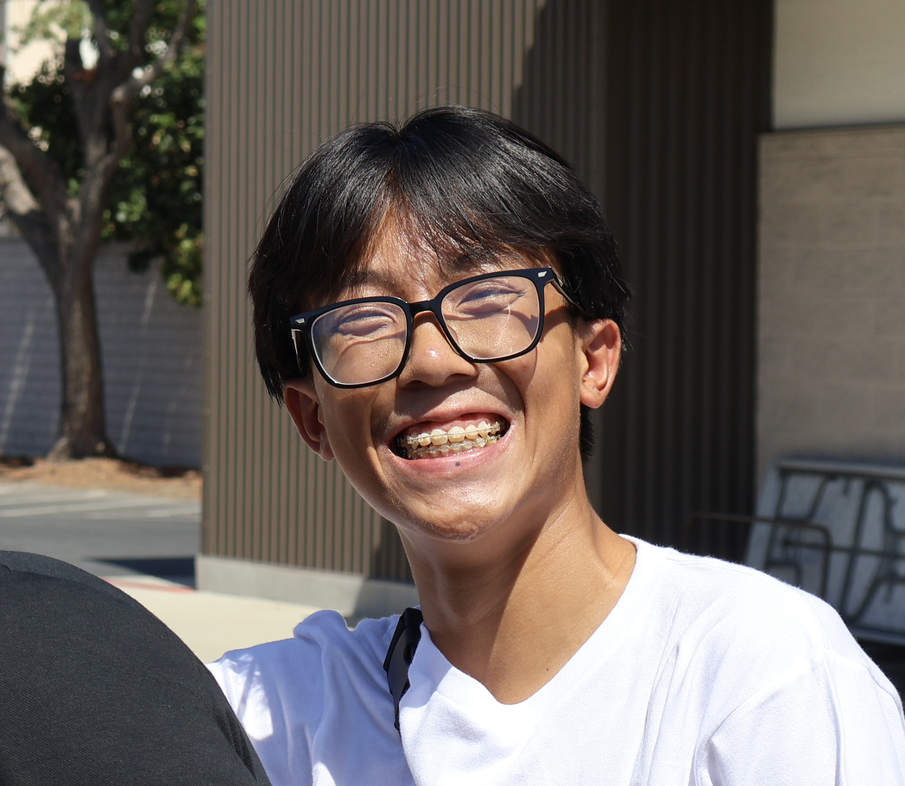

<!DOCTYPE html>
<html lang="en">
<head>
    <meta charset="UTF-8">
    <meta name="viewport" content="width=device-width, initial-scale=1.0">
    <title>Noah Aiden Chan</title>
    <link rel="stylesheet" href="style.css">
    
</head>
<body>
    <nav>
        <a href="index.html">Home</a>
        <a href="about.html">About Me</a>
        <a href="projects.html">Projects</a>
        <a href="contact.html">Contact</a>
    </nav>
    <header>
        <h1 class="center-text">Welcome to My Portfolio</h1>
        
        
Hello! My name is Noah, and this is my personal website.

    </header>

    <main>
        <h2>Welcome!</h2>
        

            I am an Chindo (Half Chinese, half Indonesian) sophmore in highschool, currently attending the #2 public highschool in California, Whitney Gretchen Highschool.
            Some things about me are:
            - I am a swimmer (main: Fly, Free, Back, IM; AA in all 50s LCM except breastroke; top 8%)
            - I play piano (ABRSM Grade 6), as well as the clarinet(Symphonic Band)
            - 
        

        <a href="projects.html" class="button">
            View My Projects
        </a>
    </main>

</body>
</html>